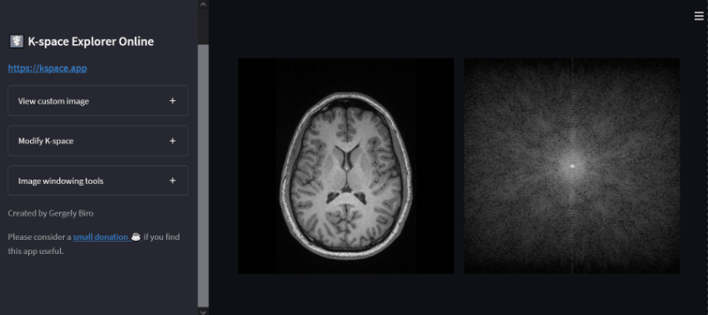

# ⚕️ MRI Image Reconstruction using K-Space ⚕️

#### 🧩 With Fourier Transform Demo

[](https://mri-image-reconstruction-using-kspace.streamlit.app/)
[](https://www.python.org/)
[](https://github.com/)

A Streamlit application that demonstrates step-by-step reconstruction of MRI images from their frequency domain (k-space) data using the 2D Fourier Transform.

This interactive tool helps users understand how low and high-frequency components contribute to the final image, showing live reconstruction of the image as more of the frequency space is progressively filled.

👉 **Live App:**  
https://mri-image-reconstruction-using-kspace.streamlit.app/

---

## ⚕️ Live Image Reconstruction




---

## 🖼️ Features

- 📂 Upload your own `.dcm` (DICOM) MRI image, or use the provided default sample.
- 🌀 Visualize the **magnitude spectrum** of the Fourier Transform (k-space).
- 🔍 Step-by-step **live image reconstruction** from k-space data.
- ⚙️ Session management using Streamlit's `session_state`.
- 🚫 Robust error handling — fallback to default image if upload fails.

---

## 🚀 How It Works

1. **Image Loading:**  
   The app accepts `.dcm` files (commonly used for medical imaging). If none is provided, it loads a default MRI image.

2. **Fourier Transform:**  
   The image is converted into its frequency domain using Fast Fourier Transform (FFT). The k-space represents spatial frequencies present in the image.

3. **Coordinate Processing:**  
   The app focuses first on reconstructing the left half of the frequency spectrum (progressive loading), prioritizing pixels closer to the center (lower frequencies).

4. **Progressive Reconstruction:**  
   Using `live_fourier_reconstruction()`, the image is reconstructed in real-time as frequency components are progressively added back.

5. **Display:**  
   View both the k-space magnitude and the live-updating reconstructed image.

---

## 📦 Installation & Local Development

To run the project locally:

```bash
git clone https://github.com/MohitGupta0123/MRI-Image-reconstruction-using-kspace.git
cd MRI-Image-reconstruction-using-kspace
pip install -r requirements.txt
streamlit run kspace.py
```

> **Note:** Replace `kspace.py` with your actual Streamlit script filename.

---

## 🖥️ Usage

- Upload a `.dcm` image file.
- Watch the k-space magnitude spectrum.
- Observe real-time image reconstruction.
- Understand how different frequency components affect image quality.

---

## 🌐 Try it Online

No need to set up locally!  
Access the live version here:  
👉 **[Launch App](https://mri-image-reconstruction-using-kspace.streamlit.app/)**

---

## 🛠️ Tech Stack

- Python 🐍
- Streamlit 🎈
- NumPy ⚙️
- Matplotlib (optional for visualization)
- DICOM image handling (assumed via `pydicom` or similar)

---

## 🤝 Contributing

Contributions are welcome! If you have ideas to improve the visualization, add more reconstruction modes, or extend this tool, feel free to open an issue or PR.

---

## ✨ Acknowledgements

- Inspiration from medical imaging techniques and MRI physics.
- Powered by Streamlit for fast web app development.

---

## Disclaimer and limitations

This software is not intended for medical use.
Even if a scanner original DICOM file is used, the resulting k-space is not equivalent to the scanner raw data as it contains all post-acquisition modifications applied by the scanner software.

---

## I hope you like it 🌟    